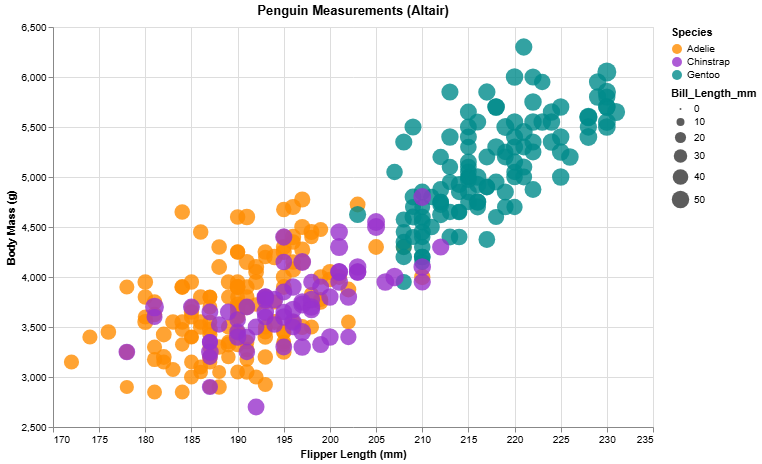
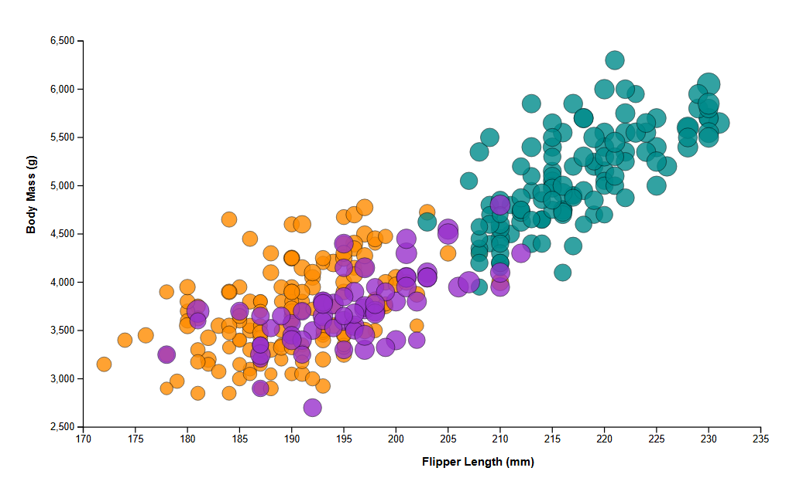
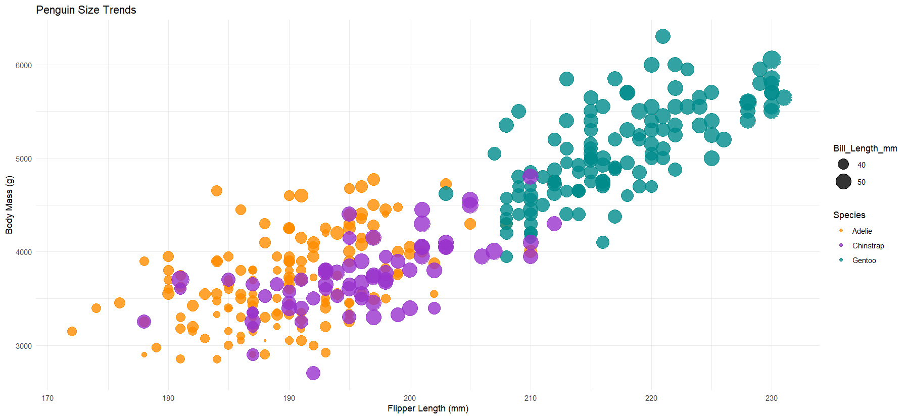
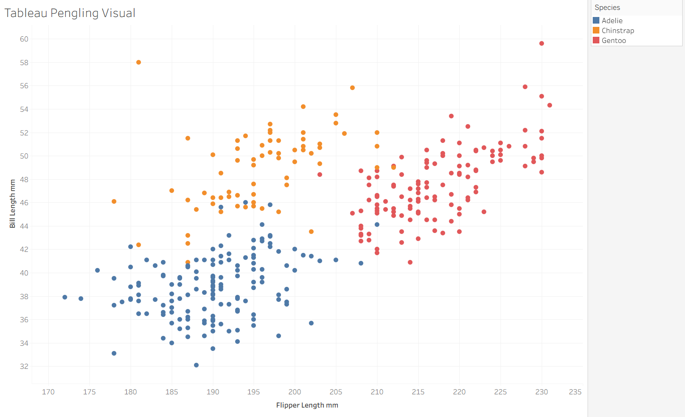

Assignment 2 - Data Visualization, 5 Ways 
===

===
# Altair (Python)

Start

# D3

Start

# Excel

Start

# R + ggplot2 + R Script

Start

# Tableau

Start

## Technical Achievements
- **IDK**: Start
- **IDK**: ...

### Design Achievements
- **IDK**: Start...
