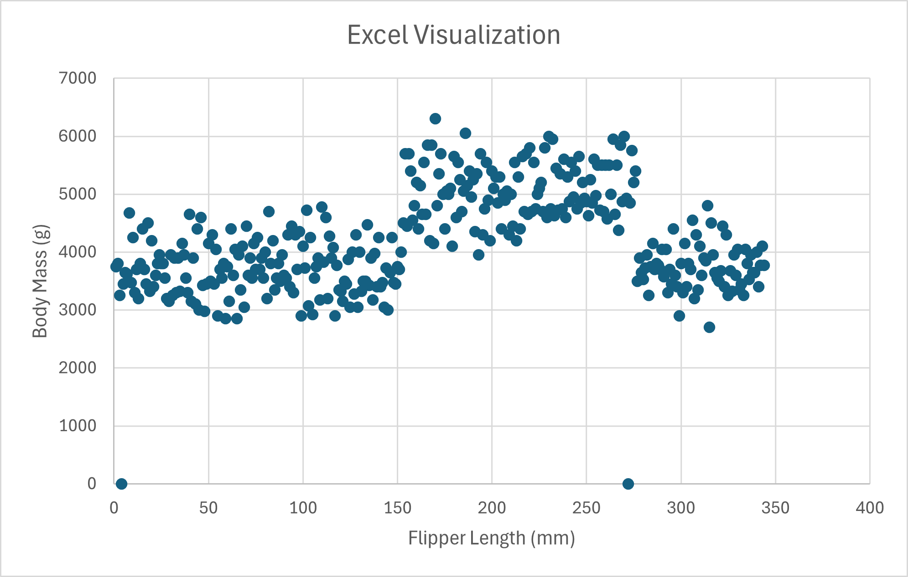

Assignment 2 - Data Visualization, 5 Ways 
===

===
# Python + Altair

Altair felt very intuitive because of its declarative syntax, making it easy to define complex encodings like color and size in just a few lines of code. The most difficult aspect was configuring the project's virtual environment in PyCharm to include the openpyxl engine needed to read the Excel file. I used a "type shorthand" hack (using: Q for quantitative data) to force Altair to recognize the numerical columns correctly, avoiding the "Discrete value supplied" errors I encountered in other tools. This tool would be perfect for future data science projects where quick, interactive exploration is needed within a Python workflow.

# D3

D3 was undoubtedly the most difficult tool to use because it requires building every component of the chart—axes, scales, and shapes—manually from scratch. The most difficult part was handling the asynchronous nature of the data loading; if the chart tries to render before the CSV is fully loaded, it fails. I had to use a specific data manipulation "hack" by applying the unary plus operator (+d.value) to coerce the CSV strings into numbers so the scales would function correctly. In the future, D3 would be incredibly useful for creating high-end, custom interactive dashboards where standard library layouts are too restrictive.

# Excel

Creating the chart in Excel was straightforward because the data was already in a spreadsheet format. However, it was difficult to maintain the design requirements; for example, Excel's default bubble charts are notoriously finicky with axis scaling and legend placement. To get the right chart, I had to use a "formatting hack" by manually setting the axis minimums (170 for X and 2500 for Y) because Excel's default "Auto" setting included too much empty white space. Excel will always be useful in the future for quick, "one-off" visualizations where I don't want to spend time setting up a coding environment.

# R + ggplot2 + R Script

The ggplot2 package was the easiest tool for mapping data variables to visual aesthetics. The difficult part was dealing with R's strict package management, as libraries like readxl had to be manually installed and loaded before the script would run. To get the chart right, I had to use a data manipulation hack by applying as.numeric() to the Bill Length column, as R initially parsed the data as a discrete character string due to formatting in the Excel file. I see this being a go-to tool in the future for any project requiring heavy statistical analysis and publication-quality static charts.

# Tableau

Tableau was the most "user-friendly" tool as it required zero coding, making the initial setup very easy. The difficult part was actually fine-tuning the design; precisely matching the specific hex codes and bubble size ratios from the example image took more time in a GUI than it did in code. I didn't need any code hacks, but I did have to perform a data manipulation by manually filtering out "Null" values in the sidebar to clean the visualization. I could see myself using Tableau in the future for corporate environments where I need to share a dashboard with non-technical stakeholders quickly.

## Technical Achievements
- **Data Type Coercion**: In both R and Python, I implemented data cleaning steps to coerce character strings into numeric values. This addressed issues where "NA" values or Excel formatting caused numerical columns to be parsed as discrete objects, which would have broken the continuous size scales.
- **Interactivity**: I added interactive tooltips to the Altair and D3 versions, allowing users to hover over individual points to see specific penguin details, adding a layer of depth beyond the static image.

### Design Achievements
- **Consistent Color Palette**: I manually synced the hex codes across all five tools (Orange: #ff8c00, Purple: #9932cc, Teal: #008b8b) to ensure the species mapping remained identical across every visualization.
- **Visual Density Management**: I utilized an 80% opacity (0.8) across all platforms. This was crucial for the penguin dataset to show "overplotting" where points overlap, giving a better sense of data density in the middle clusters.
- **Non-Zero Scaling**: I ensured that no chart started at (0,0), instead focusing the viewport on the specific range of the penguin measurements (170mm–235mm flipper length) to maximize the "data-ink ratio."
